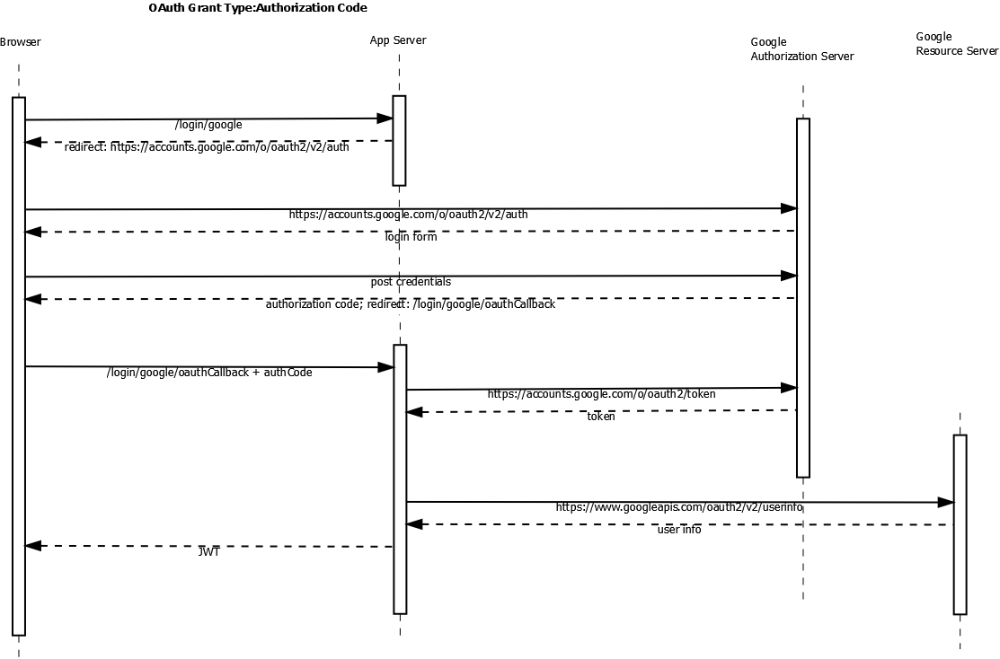
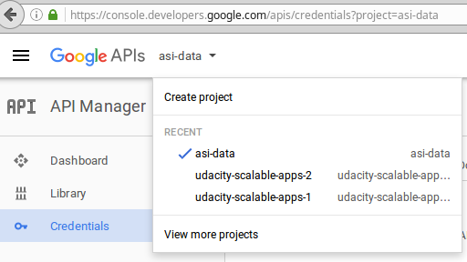

== REST Security

The application delegates user authentication to a third party OAuth2 authentication provider
such as Google or Github. Once authenticated, the application provides the client with a
Signed JSON Web Token (JWS). The client includes the JWS with each call to a REST endpoint.

User identity and authorized roles extracted from a validated JWS are used to determine whether
access is permitted to a secured endpoint.  The server maintains no state regarding a
whitelisted or blacklisted JWS. Instead, the server relies on:

* secure transport of the JWS (ex TLS)
* secure handling of the JWS on the client (ex cookie)
* periodic JWS expiry (forcing the client to re-authenticate for new token)

The application has two distinct process flows:

. acquisition of the JWS which relies on HTTP redirects and user input and hence cannot be treated as a REST endpoint
. REST API calls using the acquired JWS

== Authentication

Authentication is implemented using the OAuth 2.0 https://tools.ietf.org/html/rfc6749#section-4[authorization code grant] protocol
relying on third party authorization providers such as Google and Github. If the end user consents, the third party authorization
provider is also used as resource server for retrieving personal details such as name and email address.

The following is an example of the OAuth2 authorization code grant message flow with two extra steps:

* retrieving user information for the authenticated user
* returning a JWS to the authenticated user

=== Registering with Authorization Providers

The application must register with the third party authorization provider before the provider will accept
requests for auth codes and tokens for the applications. Registering involves the creation of a:

* `clientId` to identify the application (similar to a username, but for the application)
* `clientSecret` the "password" to be used with the `clientId`
* `scope` to identify the set of resources the application wants permission to access
* a list of allowable domains from which the application may request authorization tokens
* a callback uri which the authorization server will send back to the client as a redirect when returning the auth code

==== Google Authorization Provider

The https://developers.google.com/identity/protocols/OAuth2[Google Identity Platform documentation]
provides an overview of how to use Google as an Authorization Provider.

Credentials are created through the https://console.developers.google.com/apis/credentials?project=asi-data[Google Developers Console].
The project can be created or selected from a drop-down in the top-left corner.

A new project was created named `a4-am` with a generated id of `a4-am-155202`. From within the project:

* click `Create credentials`
* choose `OAuth Client Id` for the type of credential to create
* select `Web Application` as the application type
** enter a name to identify the client application that will be using this credential (`a4-am-client`)
** authorized origins: origins from which the application may make requests for authorization tokens (for testing `http://localhost:8080`)
** authorized redirect uris: the redirect uri Google sends back to the client after authorization. The client can then call the
redirect uri (i.e. the application server) with an authorization code which the application server can use to retrieve an access token.
An example uri: `http://localhost:8080/login/google/oauth2Callback`

=== Configuring OAuth2 Provider Endpoints on the AppServer

Once the authorization provider has been configured to accept requests from an application server,
the application server must be informed on how to connect to the authorization provider. Most of
this configuration is stored in the `application.yml` file:

.AppServer Configuration properties for OAuth2 Authorization Providers
[source,yml]
----
security:
    oauth2:

        google:
            client:
                #clientId: configured externally
                #clientSecret: configured externally
                userAuthorizationUri: https://accounts.google.com/o/oauth2/v2/auth # <1>
                accessTokenUri: https://accounts.google.com/o/oauth2/token # <2>
                clientAuthenticationScheme: query
                scope: email,profile
            resource:
                userInfoUri: https://www.googleapis.com/oauth2/v2/userinfo # <3>

        github:
            client:
                #clientId: configured externally
                #clientSecret: configured externally
                userAuthorizationUri: https://github.com/login/oauth/authorize
                accessTokenUri: https://github.com/login/oauth/access_token
                clientAuthenticationScheme: form
            resource:
                userInfoUri: https://api.github.com/user
----

<1> the `userAuthorizationUri` is the uri of the authorization server that the client will be redirected
to in order to request an authorization code. When the client redirects, it will receive an authorization
code upon authentication and be redirected back to the application server

<2> the `accessTokenUri` is the authorization server uri which the application server will contact
with an authorization code in order to receive an authorization token. The request for a token
requires the application's `clientId` and `clientSecret` to identify the application along with the
`authCode` provided by the client.

<3> the uri the application can query for user information from the authorization server (acting as a resource server)

Note that `clientId` and `clientSecret` are confidential pieces of information and are not stored with the source code.
Instead, these properties can be configured externally.  For example:

  SPRING_APPLICATION_JSON={
      "security.oauth2.google.client.clientId": "myClientId"
     ,"security.oauth2.google.client.clientSecret": "myClientSecret"
   }

=== Login Endpoint (`login/{provider}`)

OAuth2 libraries (such as `spring-security-oath2`) are not used for handling the OAuth2 communications
for authentication. Instead a redirect url is crafted based on configuration and Spring `RestTemplate`
is used for requesting the auth token and for requesting user information. The `login/{provider}` is
the endpoint for initiating the authentication process.

The `login/{provider}/oauth2callback` endpoint is the url configured on the authorization provider as the
handler for receiving the auth code that the authorization server will generate. This is the endpoint that
will request the token using the authcode, use the token to request user information, and generate
a JWS to represent the authenticated user.

The `spring-security-oath2` library was not used since it introduced a layer of complexity (unknown auto-configured
components, unknown/lightly documented library) for something that could be implemented relatively easily using an http client.
The application server also performs some non-standard behaviour such as looking up user information and
returning a JWT. However, since Spring Security is being used for authorization checks, revisiting the
potential use of `spring-security-oath2` may be warranted.

=== Spring Security Configuration

==== Maven Dependencies

[source,xml]
----
<dependency>
    <groupId>org.springframework.boot</groupId>
    <artifactId>spring-boot-starter-security</artifactId>
</dependency>
----

==== Java Config

=== Usage

To authenticate, the client makes a call to the application server with the url specifying the authorization provider to use:

* {{baseUrl}}/login/google
* {{baseUrl}}/login/facebook
* {{baseUrl}}/login/github

This will return the JWS which should be included in the `Authorization` header parameter for all
subsequent REST calls to the server.

=== References

* https://github.com/spring-projects/spring-security-oauth[spring-security-oauth source code]
* http://projects.spring.io/spring-security-oauth/docs/oauth2.html[spring-security-oauth developer's guide]
* https://spring.io/guides/tutorials/spring-boot-oauth2/[Dave Syer's Spring Boot and OAuth2 example]
* https://tools.ietf.org/html/rfc6749#section-4[RFC 6749 OAuth 2.0]
* https://developers.google.com/identity/protocols/OAuth2WebServer[Google OAuth2 Authorization Code Request]
* http://tutorials.jenkov.com/oauth2/authorization-code-request-response.html[OAuth2 Tutorial]
* https://developers.google.com/oauthplayground[OAuth2 Playground to check api properties]
* https://developer.github.com/v3/oauth/[Github OAuth]
* https://developer.github.com/v3/oauth_authorizations/#check-an-authorization[Github check authorization]
* https://docs.spring.io/spring-boot/docs/current/reference/html/common-application-properties.html[Spring Boot Common application properties]
* https://gitlab.com/palmapps/jwt-spring-security-demo/blob/master/src/main/java/nl/palmapps/myawesomeproject/security/config/WebSecurityConfig.java[JWT, Spring Security example]

=== Authorization via First Principles

Basic authorization checks could be performed relatively simply without using Spring Security.
An initial version of the application used a `ServletFilter` to intercept every incoming request for
`api/**` endpoints.  If the filter could verify the integrity of the JWS, the user would be considered
authenticated and processing was allowed to proceed.

.Registering a ServletFilter
[source,java]
----
@Configuration
public class WebConfig {

    /**
     * Registers a filter to validate JWTs on any requests accessing /api endpoints.
     *
     * @param jwtService
     * @return
     */
    @Bean
    @Autowired
    public FilterRegistrationBean JwtVerificationFilter(JwtService jwtService) {
        FilterRegistrationBean filterRegistrationBean = new FilterRegistrationBean();
        filterRegistrationBean.setFilter(new JwtVerificationFilter(jwtService));
        filterRegistrationBean.addUrlPatterns("/api/*");
        return filterRegistrationBean;
    }

}
----

.ServletFilter checking the JWT
[source,java]
----
public class JwtVerificationFilter extends OncePerRequestFilter {

    private final JwtService jwtService;

    public JwtVerificationFilter(JwtService jwtService) {
        this.jwtService = jwtService;
    }

    @Override
    protected void doFilterInternal(HttpServletRequest hsr, HttpServletResponse hsr1, FilterChain fc) throws ServletException, IOException {

        // pre-condition: uri.startsWith("/api"))  registered via FilterRegistrationBean

        String authHeader = hsr.getHeader("Authorization");
        jwtService.parseAuthorizationHeader(authHeader);

        // no authentication exception thrown: continue
        fc.doFilter(hsr, hsr1);
    }

}
----

The `userid` and `roles` of the "authenticated user" performing the request can be extracted directly from
the JWS. This could be compared against the configured roles assigned to the requested service endpoint
in order to determin authorization. If the method is assigned roles via an annotation, and the annotation proxies
the method to do a role check, then the behaviour starts looking very much like Spring Security.  Hence
the use of Spring Security, even though it brings in more detail than may have been initially desired.
